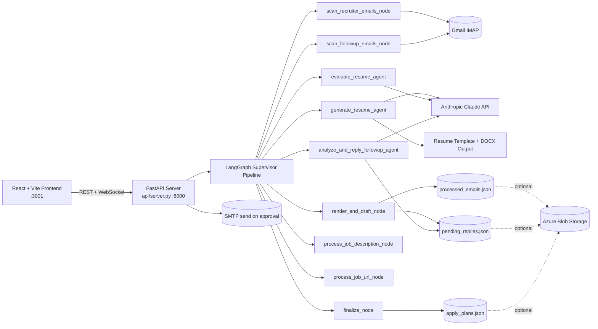

# Smart Email Triage Agent (Claude/OpenAI/Gemini + LangGraph + LangChain + Python + FastAPI + React)

AI-assisted email workflow that scans Gmail, generates tailored documents, drafts replies for human review, and tracks follow-ups/apply plans.

## What this app does

- Scans email folders for new emails and filters them as per intent (marketing email, job, service etc).
- Generates a tailored response and generate word/PDF document to attach based on classification.
- Runs an evaluator loop to score weather document generation pass the minimum criteria. 
- Attached document and retry with feedback when needed.
- Queues and follow-up replies for human review before sending.
- Handles follow-up emails and drafts intent-aware replies.
- Tracks processed emails, pending conversations, and apply-plan history.
- Persists state files and generated resumes locally, with optional Azure Blob sync.

## High-level architecture



## Main components

- `api/server.py`: API + WebSocket orchestration layer used by UI.
- `graph/graph_builder.py`: LangGraph topology and node wiring.
- `agents/supervisor_agent.py`: central router that decides next node.
- `agents/generate_resume_agent.py`: Claude resume generation + DOCX rendering.
- `agents/evaluate_resume_agent.py`: evaluator/optimizer scoring loop.
- `agents/render_and_draft_node.py`: queues recruiter replies for review.
- `agents/analyze_and_reply_followup_agent.py`: follow-up intent + draft generation.
- `agents/process_job_url_node.py`: fetches JD from URL and creates apply plan.
- `frontend/`: React dashboard for running flows and reviewing output.

## Prerequisites

- Python 3.10+ (recommended).
- Node.js 18+ and npm.
- Gmail IMAP enabled on the mailbox.
- Anthropic API key.
- SMTP credentials for sending approved replies.
- (Optional) Azure Blob config for durable state and resume storage.

## Environment setup

Create `.env` in repo root (same folder as `config.py`):

```env
# IMAP
IMAP_HOST=imap.gmail.com
IMAP_PORT=993
IMAP_USER=your_email@gmail.com
IMAP_PASSWORD=your_app_password

# Claude
ANTHROPIC_API_KEY=your_key
CLAUDE_MODEL=claude-sonnet-4-20250514

# SMTP
SMTP_HOST=smtp.gmail.com
SMTP_PORT=587

# Optional tuning
SCAN_FOLDERS=INBOX,UPDATES,JOBS_INBOX
MAX_EMAIL_AGE_HOURS=24
MAX_RESUME_ITERATIONS=2
RESUME_ACCEPTANCE_THRESHOLD=0.80
GRAPH_RECURSION_LIMIT=500
```

## Install

### Backend

```bash
python -m venv .venv
.venv\Scripts\activate
pip install -r requirements.txt
```

### Frontend

```bash
cd frontend
npm install
```

## Run

### Start API server

```bash
uvicorn api.server:app --host 0.0.0.0 --port 8000 --reload
```

### Start frontend (new terminal)

```bash
cd frontend
npm run dev
```

Open `http://localhost:3001`.

## How to use

### 1) Process Gmail + follow-up flow

1. In dashboard, select folders/lookback/quality settings.
2. Click **Process Emails**.
3. Watch progress stream from LangGraph nodes.
4. Review queued drafts in **Conversations**.
5. Edit/approve/cancel as needed.
6. Approved replies are sent through SMTP.

### 2) Paste a Job Description

1. Open **Paste JD** tab.
2. Submit JD text.
3. App generates and evaluates resume.
4. Resume is produced without recruiter-email drafting flow.

### 3) Apply from Job URL

1. Open **Apply URL** tab.
2. Paste a job posting URL.
3. App fetches JD, builds resume, and creates an apply plan.
4. Track output in **Apply History**.

## CLI mode (optional quick test)

```bash
python main.py
python main.py --phase1-only
python main.py --phase2-only
python main.py --job-description "paste JD text here"
```

## API notes

- WebSocket: `/ws/process-emails`
- WebSocket: `/ws/process-jd`
- WebSocket: `/ws/apply-from-url`
- Health: `GET /api/health`
- Config: `GET /api/config`
- Usage: `GET /api/usage`
- Resume download: `GET /api/resume/{filename}`

## State files (local)

- `processed_emails.json`
- `followup_state.json`
- `pending_replies.json`
- `apply_plans.json`
- `usage_totals.json`

These may also be mirrored to Blob storage when configured.
